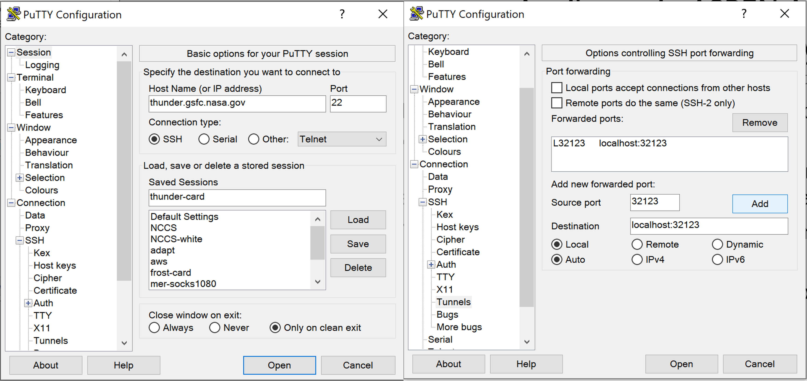

These are my quick notes/instructions for using jupyter notebooks on discover:

# Create a ssh tunnel

First, pick a 5-digit port number.  For this example, I will use 32123, but you should pick one unique to you.  What we need to do is open a port from your machine to discover.  However, you cannot do this in the forward direction.  What we do is open a 'reverse' port forward.  

Mac:  You need to create a 'reverse' port tunnel from discover to your laptop:
```
discover>    ssh -Y -N -R 32123:localhost:32123 userid@mylaptop.gsfc.nasa.gov &
```
(note:  the ssh connection is running in the background; press enter and you should have another command prompt)

Windows: You cannot ssh directly into a Windows laptop.  Thus, we'll reverse open the port from discover to thunder.gsfc.nasa.gov, and then we will open the port from your laptop to thunder.  This creates a two-hop port forward.
```
discover>    ssh -Y -N -R  32123:localhost:32123 userid@thunder.gsfc.nasa.gov &
```
(note:  the ssh connection is running in the background; press enter and you should have another command prompt)

Then in putty, add the port forward to 


You will need to have both ports open (that is, one nccs login window that creates the connection to thunder, and a putty window that creates the connection to thunder.

# Note on tunnels
If you're having trouble connecting the tunnel on discover, it might already exist.  Unfortunately, you can only have one tunnel going at a time.  You may need to kill the tunnels by hand.  A quick and easy way to list all the running tunnels is by running:
```
discover>   ~wrmccart/bin/list-sshtunnels.csh
```
You may need to ssh to the listed node and kill the ssh jobs.

# Start jupyter

On discover in the same window running the ssh port forward, first load an Anaconda module, e.g.:
```
module load python/GEOSpyD/Ana2019.10_py3.7
```
Next, change to your directory that you want to be your 'starting' directory; I ususally use my nobackup space
```
cd /discover/nobackup/userid/
```

Finally, start jupyer *without a browser*
```
jupyter notebook --no-browser --port=32123
```

# Open jupter in your browser

On your local machine, open a web browser.  In there, enter the URL
```
https://localhost:32123/
```

That URL is connecting to your machine on port 32123.  That port is actually a direct connection to discover, where jupyter is running on that same port number.  

Hopefully, you're seeing the general jupyter interface.


